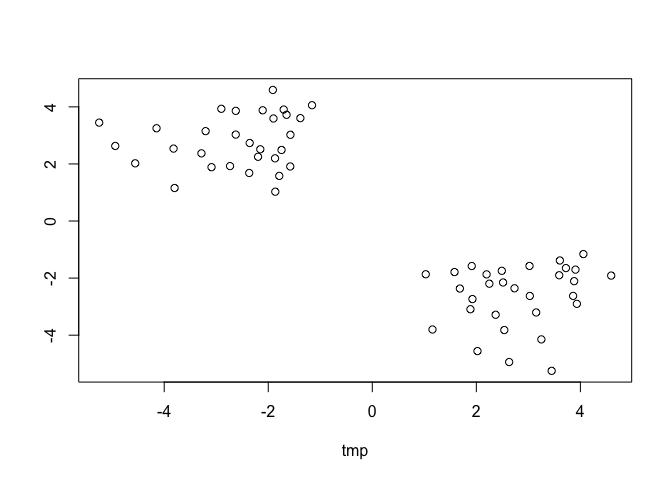
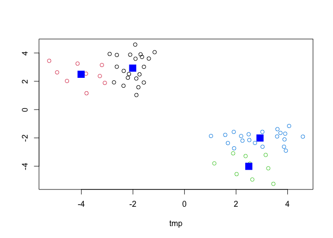
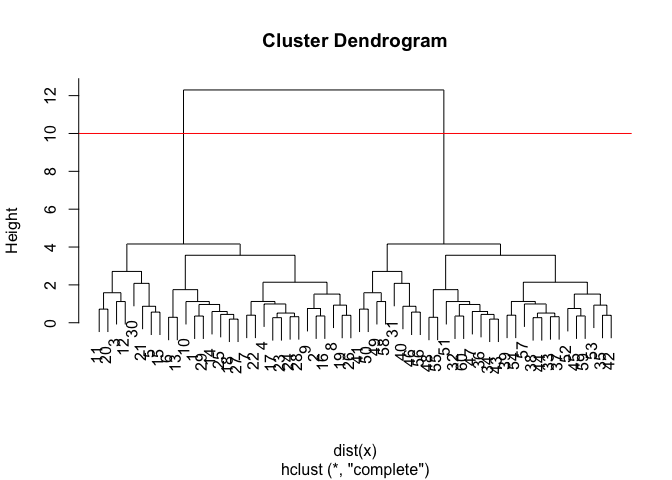
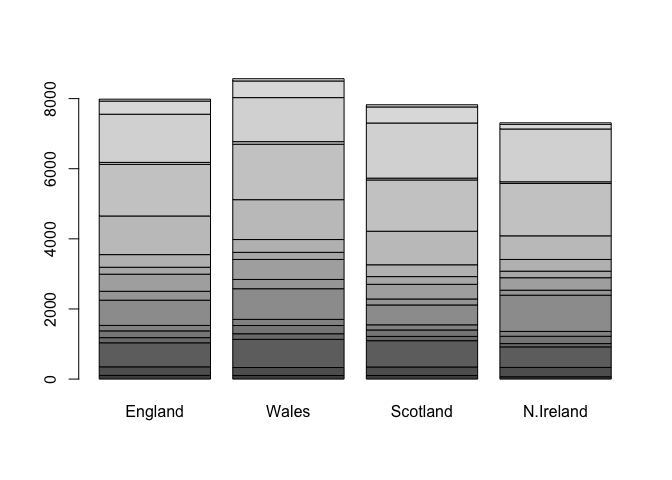
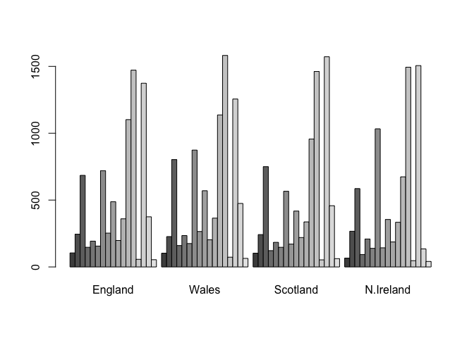
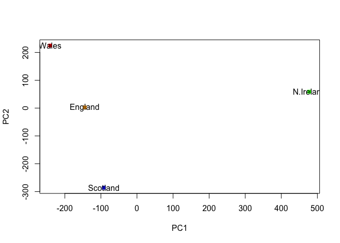
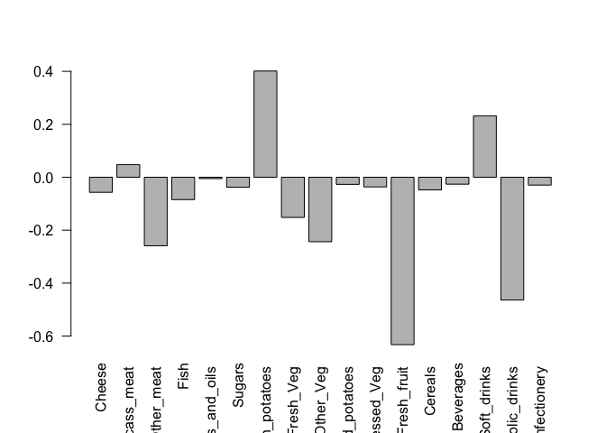
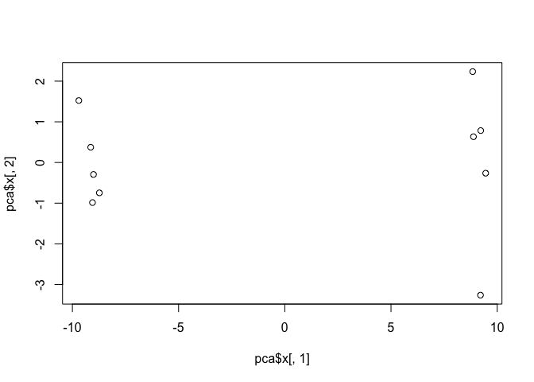

Class 7: Machine Learning 1
================
Barry (PID: 911)
2/8/2022

# Clustering methods

Find groups (a.k.a.) clusters in my data.

## K-means clustering

Make up some data to test with.

``` r
# Make up some data with 2 clear groups
tmp <- c( rnorm(30, mean = 3), rnorm(30, mean = -3) )
x <- cbind(tmp, rev(tmp))

plot(x)
```

<!-- -->

The `kmeans()` function does k-means clustering.

``` r
k <- kmeans(x, centers=4, nstart=20)
k
```

    ## K-means clustering with 4 clusters of sizes 21, 9, 9, 21
    ## 
    ## Cluster means:
    ##         tmp          
    ## 1 -2.008995  2.928992
    ## 2 -4.010625  2.494618
    ## 3  2.494618 -4.010625
    ## 4  2.928992 -2.008995
    ## 
    ## Clustering vector:
    ##  [1] 4 4 3 4 3 4 4 4 4 4 3 3 4 4 3 3 4 4 4 3 3 4 4 4 4 4 4 4 4 3 2 1 1 1 1 1 1 1
    ## [39] 1 2 2 1 1 1 2 2 1 1 2 2 1 1 1 1 1 2 1 2 1 1
    ## 
    ## Within cluster sum of squares by cluster:
    ## [1] 24.038803  9.152362  9.152362 24.038803
    ##  (between_SS / total_SS =  93.3 %)
    ## 
    ## Available components:
    ## 
    ## [1] "cluster"      "centers"      "totss"        "withinss"     "tot.withinss"
    ## [6] "betweenss"    "size"         "iter"         "ifault"

We can use the dollar syntax to get at the results (components of the
returned list).

> Q1. How many points are in each cluster?

``` r
k$size
```

    ## [1] 21  9  9 21

> Q2. What ‘component’ of your result object details - cluster size? -
> cluster assignment/membership? - cluster center?

``` r
k$size
```

    ## [1] 21  9  9 21

``` r
k$cluster
```

    ##  [1] 4 4 3 4 3 4 4 4 4 4 3 3 4 4 3 3 4 4 4 3 3 4 4 4 4 4 4 4 4 3 2 1 1 1 1 1 1 1
    ## [39] 1 2 2 1 1 1 2 2 1 1 2 2 1 1 1 1 1 2 1 2 1 1

``` r
k$centers
```

    ##         tmp          
    ## 1 -2.008995  2.928992
    ## 2 -4.010625  2.494618
    ## 3  2.494618 -4.010625
    ## 4  2.928992 -2.008995

> Q3. Plot x colored by the kmeans cluster assignment and add cluster
> centers as blue points

``` r
plot(x, col=k$cluster)
points(k$centers, col="blue", pch=15, cex=2)
```

<!-- -->

## Hierarchical Clustering

The `hclust()` function needs a distance matrix as input not our
original data. For this we use the `dist()` function.

``` r
hc <- hclust( dist(x) )
hc
```

    ## 
    ## Call:
    ## hclust(d = dist(x))
    ## 
    ## Cluster method   : complete 
    ## Distance         : euclidean 
    ## Number of objects: 60

``` r
plot(hc)
abline(h=10, col="red")
```

<!-- -->

To get our cluster membership vector we need to cut our tree and for
this we use the `cutree()`

``` r
cutree(hc, h=10)
```

    ##  [1] 1 1 1 1 1 1 1 1 1 1 1 1 1 1 1 1 1 1 1 1 1 1 1 1 1 1 1 1 1 1 2 2 2 2 2 2 2 2
    ## [39] 2 2 2 2 2 2 2 2 2 2 2 2 2 2 2 2 2 2 2 2 2 2

You can by a given height h= or into a give number of k groups with k=

``` r
cutree(hc, k=2)
```

    ##  [1] 1 1 1 1 1 1 1 1 1 1 1 1 1 1 1 1 1 1 1 1 1 1 1 1 1 1 1 1 1 1 2 2 2 2 2 2 2 2
    ## [39] 2 2 2 2 2 2 2 2 2 2 2 2 2 2 2 2 2 2 2 2 2 2

# Principal Component Analysis

## PCA of UK food data

Let’s read our data about the wierd stuff folks from the UK eat and
drink:

``` r
url <- "https://tinyurl.com/UK-foods"
x <- read.csv(url, row.names=1)
```

Look at the first bit of the file:

``` r
head(x)
```

    ##                England Wales Scotland N.Ireland
    ## Cheese             105   103      103        66
    ## Carcass_meat       245   227      242       267
    ## Other_meat         685   803      750       586
    ## Fish               147   160      122        93
    ## Fats_and_oils      193   235      184       209
    ## Sugars             156   175      147       139

How may columns in this dataset:

``` r
ncol(x)
```

    ## [1] 4

We can make some plots to try to understand this data a bit more. For
example barplots:

``` r
barplot( as.matrix(x) )
```

<!-- -->

``` r
barplot( as.matrix(x), beside=TRUE )
```

<!-- -->

# PCA to the rescue

The main base R function for PCA is called `prcomp()`. prcomp() expects
the observations to be rows and the variables to be columns therefore we
need to first transpose our data.frame matrix with the t() transpose
function.

``` r
pca <- prcomp( t(x) )
summary(pca)
```

    ## Importance of components:
    ##                             PC1      PC2      PC3       PC4
    ## Standard deviation     324.1502 212.7478 73.87622 4.189e-14
    ## Proportion of Variance   0.6744   0.2905  0.03503 0.000e+00
    ## Cumulative Proportion    0.6744   0.9650  1.00000 1.000e+00

What is in this returned pca object?

``` r
attributes(pca)
```

    ## $names
    ## [1] "sdev"     "rotation" "center"   "scale"    "x"       
    ## 
    ## $class
    ## [1] "prcomp"

``` r
plot( pca$x[,1:2], col=c("orange", "red", "blue", "green"), pch=15 )
text( pca$x[,1], pca$x[,2], labels=colnames(x))
```

<!-- -->

We can look at how the variables contribute to our new PCs by examining
the `pca$rotation` component of our results.

``` r
barplot( pca$rotation[,1], las=2 )
```

<!-- -->

# An RNA-Seq PCA example…

Read the data first

``` r
url2 <- "https://tinyurl.com/expression-CSV"
rna.data <- read.csv(url2, row.names=1)
head(rna.data)
```

    ##        wt1 wt2  wt3  wt4 wt5 ko1 ko2 ko3 ko4 ko5
    ## gene1  439 458  408  429 420  90  88  86  90  93
    ## gene2  219 200  204  210 187 427 423 434 433 426
    ## gene3 1006 989 1030 1017 973 252 237 238 226 210
    ## gene4  783 792  829  856 760 849 856 835 885 894
    ## gene5  181 249  204  244 225 277 305 272 270 279
    ## gene6  460 502  491  491 493 612 594 577 618 638

How many genes (how many rows)?

``` r
nrow(rna.data)
```

    ## [1] 100

How many experiments (columns)?

``` r
ncol(rna.data)
```

    ## [1] 10

Let’s do PCA of this dataset. First take the transpose as that is what
the prcomp() function wants…

``` r
pca <- prcomp( t(rna.data), scale=TRUE)
summary(pca)
```

    ## Importance of components:
    ##                           PC1    PC2     PC3     PC4     PC5     PC6     PC7
    ## Standard deviation     9.6237 1.5198 1.05787 1.05203 0.88062 0.82545 0.80111
    ## Proportion of Variance 0.9262 0.0231 0.01119 0.01107 0.00775 0.00681 0.00642
    ## Cumulative Proportion  0.9262 0.9493 0.96045 0.97152 0.97928 0.98609 0.99251
    ##                            PC8     PC9      PC10
    ## Standard deviation     0.62065 0.60342 3.348e-15
    ## Proportion of Variance 0.00385 0.00364 0.000e+00
    ## Cumulative Proportion  0.99636 1.00000 1.000e+00

We can make our score plot (a.k.a. PCA plot) from the `pca$x`.

``` r
plot(pca$x[,1], pca$x[,2])
```

<!-- -->

Make a little color vector to color up our plot by wt and ko

``` r
colvec <- c(rep("red", 5), rep("blue", 5) )
plot(pca$x[,1], pca$x[,2], col=colvec, pch=15)
```

<!-- -->

``` r
y <- c(1:5)
z <- c("red", "blue")
cbind(y, z)
```

    ## Warning in cbind(y, z): number of rows of result is not a multiple of vector
    ## length (arg 2)

    ##      y   z     
    ## [1,] "1" "red" 
    ## [2,] "2" "blue"
    ## [3,] "3" "red" 
    ## [4,] "4" "blue"
    ## [5,] "5" "red"

``` r
kmeans(pca$x[,1:2], centers=2)
```

    ## K-means clustering with 2 clusters of sizes 5, 5
    ## 
    ## Cluster means:
    ##         PC1         PC2
    ## 1  9.125676  0.02574049
    ## 2 -9.125676 -0.02574049
    ## 
    ## Clustering vector:
    ## wt1 wt2 wt3 wt4 wt5 ko1 ko2 ko3 ko4 ko5 
    ##   2   2   2   2   2   1   1   1   1   1 
    ## 
    ## Within cluster sum of squares by cluster:
    ## [1] 16.974187  4.575245
    ##  (between_SS / total_SS =  97.5 %)
    ## 
    ## Available components:
    ## 
    ## [1] "cluster"      "centers"      "totss"        "withinss"     "tot.withinss"
    ## [6] "betweenss"    "size"         "iter"         "ifault"
